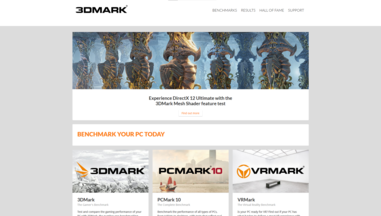
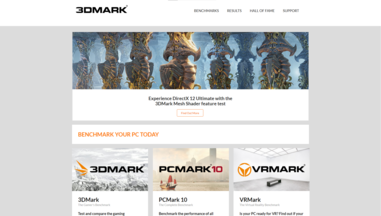

## What are UI Frameworks?

Many students interested in technology and computer science have probably heard of terms like UI Framework and tool sets before, but what exactly are they and how do they work? To simply put it, UI Frameworks are a set of classes and interfaces that define elements and behaviors of a user interface (UI). It serves as a structure and a tool to aid developers make applications and programs for front end purposes like making a website or designing a mobile app. With that being said, learning a UI Framework isn't always easy. Just like learning a programming language, internalizing and adopting new templates and syntax takes time and practice but I believe the tradeoff of learning one has many benefits.

## What are their benefits?

Some UI Frameworks you have probably heard of, like Angular, Bootstrap, React, Meteor and many others are all designed for a common purpose: to speed up the development process and make it as streamline as possible for developers to adopt. These UI frameworks have an extensive library of UI documentation for developers to implement and this can be time saving because instead of purely programming and desining a button in HTML for example, a developer can simply use documentation for a UI framework library and create one within a matter of seconds.

## My Experience with UI Frameworks

Some of my experience with UI Frameworks are with Semantic UI which is a very simple and user-friendly framework that takes on the use of natural langauge to improve efficiency of creating beautiful website layouts. I think the benefits of Semantic UI that I have seen are very worthwhile because I was able to recreate numerous websites purely from the Semantic's library of UI components. If I had not learned and used a framework like Semantic, It would have taken a lot longer for me to create and make the HTML websites that I was able to.

Shown below is one of the websites that I was able to recreate using Semantic UI.

<b>Original</b>

<b>Recreation</b>

