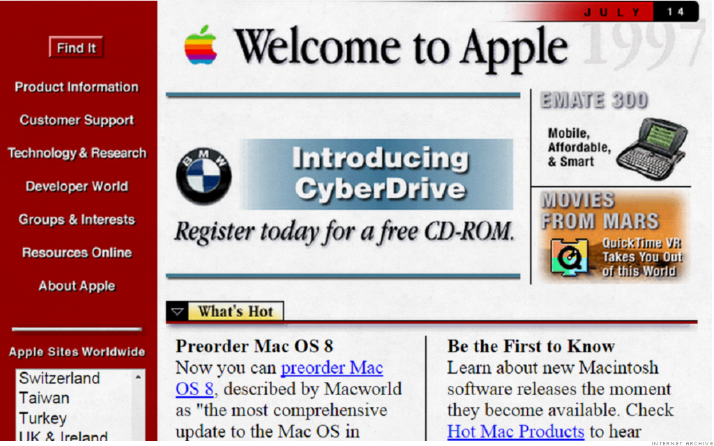

## The History of Design Patterns

Long before popular websites and applications that we all know today, like Facebook, Youtube, Yahoo, Google, and so forth, there was arguably no correct way to build or design such an application. Through the advancements in software engineering and the introduction of things like modern frameworks, templates, and open source communities, design patterns have surfaced to serve as a structure/architecture for developers as a way to guide them in whatever it is they wish to make with the added benefit of reduced complications and improved efficiency. With that being said, in recent years, design patterns have become increasingly popular and useful in accelerating the software design process and are discussed by many developers alike.

## Patterns in Programming

Similarly to the anatomy of a car and how they're built, design patterns represent tried and true "blueprints" so to speak, on the basis of creating something that is functional, applicable to many different use cases and reusable. In addition to this, design patterns are useful because they are kind of like a versatile solution to many problems that beginning programmers may face in the process of creating their application. Considering that design patterns have evolved over long periods of time, with the efforts of many software developers, its usefulness aren't questions of concern but rather whether they will serve as the best practices for modern standards of software development.

## The Practicality of MVC

There are many design patterns out there, but not enough people to take advantage of their applicability. A design pattern that I am currently using and working with is something called MVC, or otherwise known as the Model-View-Controller design pattern. For many people, the MVC design pattern is the mostly used for web development and applications and that's exactly that I am using it for. In a class that I am taking called ICS 314: Software Engineering, we focus on creating applications that follow the MVC design pattern where the user is able to interact or serve as the "Controller" to the website, in which case the "Model" updates data and interacts with the api accordingly to render the user interface to view. Using MVC in this class, I was able to build an application using the Meteor web framework, React-Semantic UI, and MongoDB to create a visually appealing web application that dynamically updates data in the backend for users and is ultimately controlled by the Meteor API.

.
