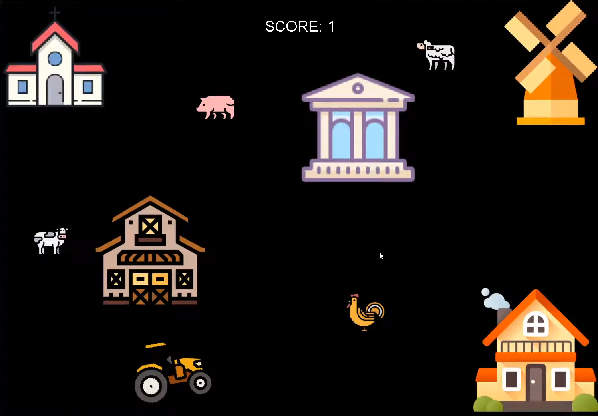

## Overview

Farm-tastic is a simple point based game designed using [EZ Graphics](http://www2.hawaii.edu/~dylank/ics111/) and Java where players can drive a tractor around and their objective is to horde all the farm animals on a map created with obstables that players will have to avoid or they will crash.

This game was created when I took my very first ICS class at UH Manoa. With the help of EZ, which is a library of multimedia functions designed to make it easier for novice programmers build java applications with graphics and sound, I was able to use Eclipse IDE along with the Java Development Kit to create this simple game while incorporating concepts that I learned in the course, such as classes instances and object oriented programming. While programming this game, I learned some interesting things about how coordinates and visual boundaries work. Some of the things that I struggled with, like making it so that the tractor can't go through the buildings has strengthened my programming skills and improved the way I think about problems.

## Source Code

A link to a demonstration video of this game can he found [here](https://www.youtube.com/watch?v=fOM2NSGOULc&feature=youtu.be). The video also shows the source code that I worked with to make this game function and sound the way it does.
