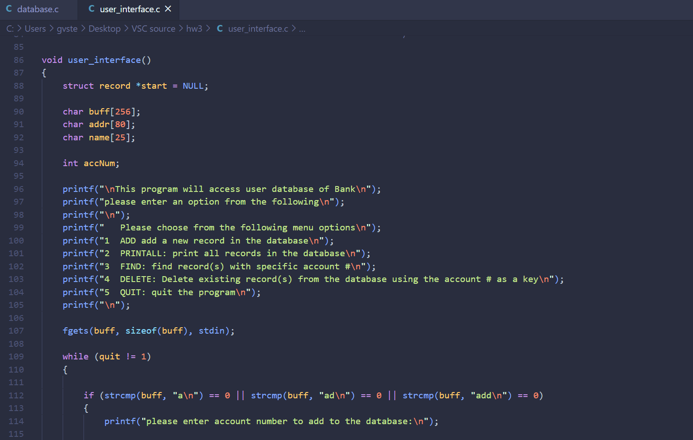

##Bank Record Database Simulator

The Bank Record Database is a project that I made in a unix terminal while taking ICS 212: Program Structure. This project is basically a simulation of a bank interface as if someone was managing a database of accounts and bank clients. Some functions that this program is capable of is adding, deleting, printing, finding records as well as exiting when called. From a given printed menu of options, users are able to chose from those options and then the corresponding actions will be performed based on that.

This project, though it may seem simple was actually something that I struggled on because I was just learning new concepts of the C language as well as getting used to unix. One of the main things I learned from this project was being able to incorporte and "#include" different classes that simplify and form a structure for my program. Additionally, I also learned more on how input and output behaves in C, its formats, and using C language to create an algorithm that filters such input/output.  

Source Code to be released soon.
